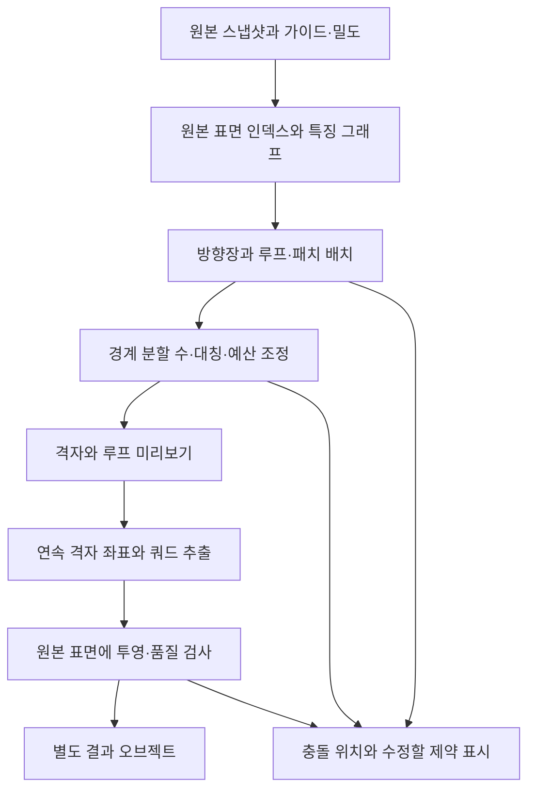

# 루프와 격자를 중심으로 한 리토폴로지 엔진 재설계

작성일: 2026-09-20. 상태: **공통 격자 경로의 첫 구현을 검증 중이다. 큐브·열린 직선 튜브만 합격했고, 얼굴·관절·큰 캐릭터의 전체 기준은 통과하지 않았다.**

이 문서는 다음 엔진의 개발 기준이다. [기존 구조](architecture.md)는 현재 Python 실험 엔진의 동작 기록으로 유지한다. 공개 버전 0.3.0에는 아래의 격자 경로가 포함되지 않았다.

## 1. 목표와 결정

- 평면에서는 간격이 일정한 사각 격자, 팔다리에서는 둘레의 닫힌 링과 길이 방향의 연속된 엣지 열을 만든다.
- 부위 가이드가 주어진 얼굴에서는 눈·입 주위의 여러 겹 루프, 코 능선·콧구멍·귀 윤곽의 연결을 명시적으로 다룬다.
- 대칭, 특징선, 루프 연결을 필수 조건으로 보존하고, 목표 쿼드 수와 밀도는 그 안에서 조정한다.
- **표면상의 루프·패치 배치 → 공유 경계의 정수 분할 수 → 연속적인 격자 좌표 → 쿼드 추출**을 핵심 경로로 채택한다.
- 큰 희소 행렬 계산과 격자 추출은 별도 C++ 실행 파일로 분리한다. Blender Python은 입력, 가이드 편집, 미리보기, 실행 제어와 결과 적용을 맡는다.
- 기존 삼각형 짝짓기와 중심점 분할은 새 엔진의 최종 쿼드 생성 경로에서 제외한다. 새 엔진 실패 시 기존 엔진으로 몰래 대체하지 않는다.
- 일반 형상의 자동 배치와 캐릭터의 부위별 루프 제어를 구분한다. 첫 얼굴 지원은 **사용자가 지정한 부위 가이드 기반**이다. 얼굴 부위 자동 인식은 별도 후속 범위이며 현재 설계가 구현됐다는 이유로 지원을 주장하지 않는다.

큐브와 원통은 공통 알고리즘을 검증하는 기본 사례다. 오브젝트 이름이나 기본 도형 종류에 따른 별도 생성기로 이 검사만 통과시키지 않는다. 삼각화 방향, 입력 밀도, 회전이 달라도 같은 형상과 제약에 대해 같은 격자 구조가 나와야 한다.

## 2. 기존 엔진에서 확인한 부족한 부분

`engine.py`의 국소 삼각형 매칭과 패치 중심 분할은 전체 루프 연결을 결정하지 않는다. `field.py`의 정렬은 정점 위치를 바꾸지만 면 연결은 그대로 둔다. 기존 `GuideCurveData`에는 닫힘 여부, 부위, 필수 루프, 표면 영역의 정보가 없다.

2026-09-20 현재 로컬 코드에서 직접 실행한 진단:

| 입력과 조건 | 결과 | 의미 |
| --- | --- | --- |
| 기본 큐브, 목표 384 | 382쿼드, 쿼드 비율 100%, 평면 내부의 4가 아닌 연결 차수 정점 2개 | 쿼드 비율은 통과하지만 규칙적인 평면 격자 요구는 실패 |
| 열린 원통, 둘레 16분할·길이 4분할, 목표 128 | 128쿼드, 쿼드 비율 100%, 옆면 내부의 4가 아닌 연결 차수 정점 0개 | 이 수치만으로 링의 폐쇄·방향·간격까지 통과했다고 판정할 수 없음 |

위 결과는 기존 엔진의 직접 실행 결과이며 새 엔진의 성능 증거가 아니다. 사용자가 보여준 큐브의 불규칙한 분기와 캐릭터의 부적절한 흐름을 회귀 검증 대상으로 삼는다. 개인 모델과 스크린샷은 공개 저장소에 포함하지 않는다.

## 3. 처리 구조

일반 자동 실행에서는 지원 범위 안에서 배치를 시도하고, 모호하거나 충돌한 경우에는 진단을 반환한다. 미리보기는 확인·수정 수단이며 매 단계마다 사용자의 승인을 요구하지 않는다. 입력 제약이 모호할 때만 해당 부위의 지정이나 수정을 요청한다.

### 3.1 원본과 표면 출처

원본 삼각 표면에 영구적인 작업 내 ID를 부여한다. 출력 정점의 대응은 `component_id`, 원본 삼각형 ID, 삼각형 안의 무게중심 좌표, 허용 표면 영역을 함께 가진다. 컴포넌트가 같은 접힌 피부나 겹친 갑옷도 다른 면으로 투영될 수 있으므로 컴포넌트 번호만으로 대응을 판단하지 않는다.

비다양체 연결과 방향 충돌은 최초 분석에서 검출한다. 작업 사본의 분리 수리를 지원할 때는 원본과 수리 후의 경계·컴포넌트 차이를 따로 기록하고 가이드 대응을 다시 검사한다. 구멍을 자동으로 메우거나 떨어진 피부를 합치지 않는다. 연결 의도가 불명확하고 안전한 대응을 만들지 못하면 `INVALID_SURFACE`를 반환한다.

큰 입력의 축소본은 방향과 패치의 초기 후보 계산에 사용한다. 최종 투영, 가이드 경로, 오차 판정은 원본을 기준으로 한다. 고정 4,000삼각형 축소본을 최종 형상의 기준으로 사용하지 않는다. 특징선·가이드 주위는 충분한 해상도를 남기고, 대응을 잃은 부위는 국소 해상도를 높여 다시 계산한다.

초기 입력 모드는 현재와 같은 기본 메시다. 모디파이어 평가 결과, UV·웨이트·셰이프 키 전송은 별도 작업이다. 좌표 변환과 단위를 스냅샷에 고정하고, 길이·면적은 오브젝트 변환을 반영한 거리 기준으로 계산한다. 대칭 평면은 오브젝트 로컬 원점과 선택 축에서 유도한다. 출력은 역변환하여 기존 오브젝트 변환과 함께 적용한다. 역변환 불가능한 변환은 입력 오류로 처리한다.

### 3.2 특징과 가이드

경계, sharp 엣지, 곡률 변화는 배치 후보를 제공한다. UV seam은 선택적으로 특징선으로 취급하며 모든 seam을 강제로 고정하지 않는다. 원통형 부위는 길이 방향과 둘레 방향을 추정하고, 축 가이드가 있으면 그 조건을 우선한다. 분기나 변형 때문에 후보가 모호하면 대상 영역과 축 가이드를 요청한다.

| 가이드 종류 | 역할 | 필수 조건 여부 |
| --- | --- | --- |
| `DIRECTION` | 주변 격자의 방향 선호 | 선호 조건 |
| `LOOP` | 표면 위의 닫힌 엣지 루프 | 필수 |
| `STRIP` | 두 지점·루프 사이를 잇는 엣지 열 | 필수 |
| `AXIS` | 팔다리 부위의 길이 방향 기준 곡선. 표면 내부에도 배치 가능 | 지정한 부위의 방향 기준 |
| `SEAM_HINT` | 원통 등을 펼칠 때 사용할 절개 위치 | 선호 조건 |
| `REGION` | 부위 범위, 분기 정점 금지 구역, 보존할 표면 | 필수 |

가이드는 종류와 별도로 `eye_left`, `mouth`, `nose_bridge`, `nostril`, `ear`, `limb` 등의 부위 라벨을 가진다. 라벨만으로 연결을 추측하지 않고 대상 영역, 포함 관계, 시작점, 방향을 명시한다. 기존 `REMESH_GUIDE_` 커브는 `DIRECTION`으로 이관한다. 기존 커브를 자동으로 눈·입의 필수 루프로 해석하지 않는다.

`LOOP`에는 닫힘, 감쌀 기준점 또는 경계, 루프 주변의 띠 개수, 선택적인 둘레 분할 수를 저장한다. 기존 POLY·BEZIER 입력을 유지하고 Blender의 cyclic 설정과 마지막 구간을 정확히 수집한다. 열린 곡선을 임의로 닫거나 다른 표면으로 투영하지 않는다. 자체 교차, 서로 충돌하는 루프, 잘못된 부위 대응은 격자 생성 전에 표시한다.

### 3.3 표면 전체의 배치

방향장은 초기 방향을 정한다. 이후 특징선과 필수 루프를 표면 그래프에 삽입하고, 분기 정점과 패치 경계를 함께 결정한다. 최종 메시의 분기 위치를 정한 뒤 정점 좌표를 맞춘다.

- 평면 내부에는 불필요한 분기 정점을 두지 않는다. 큐브의 기하학적 모서리와 꼭짓점은 특징 그래프로 처리한다.
- 팔다리의 옆면은 주기적인 띠로 표현한다. 절개선 양쪽은 같은 둘레 격자의 경계이며 추출 후 위상 ID로 다시 연결한다.
- 부위 가이드가 주어진 얼굴의 눈·입은 여러 겹의 띠로 구성한다. 코 능선은 열린 엣지 열, 콧구멍과 귀 윤곽은 해당 표면의 폐루프와 연결 영역으로 다룬다. 폐루프를 생성한다고 메시의 구멍을 뚫거나 메우지 않는다.
- 겨드랑이, 사타구니, 입가처럼 흐름이 합쳐지는 곳은 검증된 전이 패치로 연결한다. 분기 정점은 지정된 전이 영역 안에 배치하고 관절의 굽힘 띠·눈꺼풀·입술 띠에는 두지 않는다.
- 전이 패치는 입력·출력 경계의 연결 순서, 차수, 분할 수 관계를 실제 그래프로 정의한다. 일반적인 분기 전체에 임의의 하나의 면수 합산 공식을 적용하지 않는다.
- 구나 복잡한 닫힌 표면에서 모든 정점을 4차수로 만들겠다고 보장하지 않는다. 필요한 분기의 수·종류·위치를 배치 단계에서 기록하고 최종 출력과 대조한다.

패치 경계마다 원본 경로, 양쪽 패치, 필수/선호 구분을 저장한다. 분기 배치가 불가능하면 충돌한 영역을 반환한다. 결과를 본 뒤 모든 불규칙 정점을 허용 목록에 추가하는 방식은 금지한다.

### 3.4 정수 격자와 목표 면수

공유 경계의 분할 수는 단일 정수 변수다. 사각 패치의 마주 보는 변, 원통 절개선의 양쪽, 대칭 대응 경계는 서로 필요한 등식으로 묶는다. 단순 띠 안에서 링의 정점 수는 일정하게 유지한다. 링의 수가 바뀌는 곳은 선언된 전이 패치만 허용한다.

필수 제약을 만족하는 후보 중 면수 차이, 셀 크기 차이, 형상 왜곡을 줄인다. 모든 조건을 하나의 가중합으로 두어 작은 비용으로 필수 루프를 없애는 해를 허용하지 않는다. 배치 후보 수·정수 변수 범위·시간 예산을 제한하고 탐색 상태를 보고한다.

- 큐브의 동일 간격 격자는 `6*n*n`개 면을 갖는다. 예를 들어 목표 384는 각 면 8×8, 목표 500은 가까운 후보 486과 그 차이를 설명한다.
- 대칭은 복제 배수를 최종 면수 계산에 포함한다. 평면에 놓인 면과 공유되는 경계는 실제 궤도 크기로 센다.
- `target_quad_count`는 삼각형 수가 아닌 최종 쿼드 수다. 필수 루프가 지정한 최소 분할 수를 목표 수 때문에 줄이지 않는다.
- 인증된 하한과 실제 찾은 가능한 면수를 구분한다. 현재 배치에서만 구한 하한을 모든 가능한 배치의 최소 면수로 주장하지 않는다.
- 시간 초과·해 탐색 실패를 수학적인 불가능 판정으로 표시하지 않는다. 가능한 결과가 없으면 원본을 유지하고 제약·예산 진단을 반환한다.

밀도는 단위 면적당 원하는 쿼드 수로 정의한다. 양수 가중치 `w`를 전체 면수로 정규화하여 `rho = N*w / integral(w*dA)`, 목표 엣지 길이를 `h ≈ 1/sqrt(rho)`로 둔다. 실제 분할 수는 이 크기에 가까운 정수 해를 선택한다. 밀도 변화는 완만하게 제한하고, 급격한 변화에는 전이 영역을 배정한다. 대칭 사용 시 양의 영역 밀도를 대응 영역에 복제하는 기존 의미를 유지한다.

### 3.5 격자 좌표, 추출과 투영

패치 안에 두 개의 연속 좌표 `u`, `v`를 구하고 공유 경계의 정수 좌표와 방향을 일치시킨다. 인접 차트 사이의 변환은 90도 회전과 정수 평행이동으로 추적한다. 원통에서는 절개 양쪽의 정수 간격이 주기를 정의한다.

필수 루프는 격자 좌표선으로 고정한다. 방향을 비슷하게 맞추는 비용 항만으로 루프 조건을 구현했다고 판단하지 않는다. 뒤집힌 매핑, 중복 경계, 제약을 만족하지 못한 격자 좌표는 추출 전에 거부하거나 배치를 다시 계산한다.

정수 좌표선의 교차와 셀을 추출하여 쿼드를 만든다. 이미 정해진 원본 표면 영역 안에서 위치를 개선하며, 루프 ID와 경계 대응은 유지한다. 점으로만 닿는 표면은 좌표가 같아도 용접하지 않는다. 인접하지 않은 결과 면의 교차도 검사하고 원본에 이미 있던 교차와 새로 생긴 교차를 구분해 보고한다.

## 4. 데이터 계약과 실행 경계

아래 계약은 목표 구조다. 현재 로컬 구현은 `EngineInput`에 가이드 종류·닫힘 여부와 엔진 모드를 추가했고, `planar.py`·`periodic.py`의 제한된 격자 생성기만 연결했다.

| 계약 | 주요 내용 |
| --- | --- |
| `SurfaceSnapshot` | 입력 지문, 좌표 변환, 원본 정점·삼각형, 원본 면 ID, 컴포넌트·표면 영역, 특징선, 밀도 |
| `GuideConstraint` | ID, 종류, 부위 라벨, closed, 표면 경로 또는 내부 축 경로, 대상 영역, 감쌀 대상, 띠 수, 분할 수, 대칭 대응 |
| `LayoutGraph` | 패치, 경계의 순환 순서, 필수 루프, 분기 정점, 주기 절개, 대칭 궤도, 전이 패치 |
| `IntegerGridPlan` | 공유 경계 정수 변수, 차트 크기, 제약 잔차, 실제 면수, `certified_lower_bound`, `searched_feasible_count`, `search_status`, 하한이 성립하는 배치 범위 |
| `RetopoResult` | 정점·쿼드, 표면 출처, 가이드→출력 엣지 경로, 패치·분기 ID, 품질 보고, 단계별 소요 시간 |

신규 worker 프로토콜은 `protocol_version`, `engine_version`, `job_id`, 입력 지문과 지원 기능 목록을 가진다. 배열은 바이너리 버퍼, 작은 메타데이터와 진행률은 JSON으로 전달한다. 전체 메시를 Python 중첩 리스트와 거대한 JSON 문자열로 여러 벌 복제하지 않는다. Blender 데이터는 메인 스레드에서 제한된 청크로 읽고 스냅샷 완료 후 계산한다. 추출 중 입력 변경도 검사한다.

worker는 원본·프로파일을 수정하지 않고 외부 네트워크 없이 실행한다. 부모는 작업 취소와 종료를 관리하고 임시 파일을 정리한다. 적용 직전에 원본·가이드·밀도·설정 지문을 다시 대조한다.

오류 코드는 `INVALID_SURFACE`, `AMBIGUOUS_GUIDE`, `CONSTRAINT_CONFLICT`, `SEARCH_TIMEOUT`, `UNSUPPORTED_TOPOLOGY`, `QUALITY_REJECTED`, `CANCELLED`로 구분한다. 제품 화면에는 충돌 위치와 조치만 표시하고 solver 내부 용어를 기본 흐름에 노출하지 않는다.

`search_status`는 `FEASIBLE`, `PROVEN_CONFLICT`, `TIMEOUT_WITHOUT_PROOF`, `NO_SOLUTION_FOUND`를 구분한다. 증명된 충돌에는 충돌 제약 ID와 증명 범위를 포함한다. 시간 초과에 이미 유효한 후보가 있으면 후보와 탐색 종료 이유를 함께 반환하며, 품질 검사를 생략하지 않는다.

## 5. 구현 모듈과 기존 코드 이관

| 위치 | 책임 |
| --- | --- |
| `addon/topology/contracts.py` | 입력·배치·결과 계약과 버전 검사 |
| `addon/topology/guides.py` | Blender 커브의 닫힘·부위·표면 제약 수집 |
| `addon/topology/client.py` | 실행 파일 선택, 바이너리 전송, 진행률·취소 |
| `addon/topology/preview.py` | 루프, 분기 위치, 배치 충돌 미리보기 |
| `native/surface/` | 표면 출처, BVH, 특징·거리 계산 |
| `native/layout/` | 방향장, 필수 경로, 패치·전이 배치 |
| `native/grid/` | 공유 경계 정수 해와 연속 격자 좌표 |
| `native/extract/` | 쿼드 추출과 대응 경계 연결 |
| `native/quality/` | 루프·분기·격자·형상 검증 |

`operators.py`의 비파괴 결과 적용·취소·입력 변경 거부와 Extension 등록 구조는 재사용한다. 기존 `core.py` 계약은 v1 어댑터로 유지하고 새 계약을 암묵적으로 섞지 않는다. 기존 방향장 코드는 비교용으로 남기고 결과 품질의 기준 엔진으로 사용하지 않는다.

로컬 개발본의 `AUTO`는 지원하는 형상에 격자 경로를 우선 적용하고, 지원하지 않는 형상에는 실험 엔진 사용을 결과에 경고한다. `STRUCTURED`는 지원 범위 밖에서 결과 적용을 중단하고, `LEGACY`는 기존 엔진을 명시적으로 선택한다. 필수 `LOOP`·`STRIP` 가이드는 보존할 수 없는 경로에서 오류로 처리한다. 공개 0.3.0 설치본의 동작이 이 로컬 변경으로 바뀌지는 않는다.

## 6. 네이티브 계산 라이브러리 선정 기준

정수 격자 파라미터화와 쿼드 추출을 직접 모두 재작성하지 않고 공개 구현을 우선 검증한다. MIQ 계열의 전역 파라미터화와 libQEx의 정수 격자 추출을 첫 검토 대상으로 둔다. **라이브러리 이름을 결정하는 것과 우리 제약을 구현하는 것은 별도 작업이다.** libQEx 자체는 눈·입 루프를 설계하지 않는다.

| 조사 후보 | 결정과 남은 검증 |
| --- | --- |
| libigl의 MIQ 어댑터 + CoMISo + libQEx | R0의 첫 실험 후보. libigl v2.5.0의 MIQ 헤더는 확인했지만 현행 main의 동일 경로에는 없다. 해당 헤더 자체가 어려운 hard feature와 열린 경계 처리의 한계를 명시하므로 무수정 채택을 가정하지 않는다. 전체 의존성·빌드 조합과 필수 루프 제약 확장을 검증해야 한다. |
| QuadWild | 특징선을 패치 경계로 보존하는 구조를 참고한다. 공식 빌드 절차가 Gurobi를 요구하므로 현재 배포 스택으로 채택하지 않는다. 이를 대체하는 solver의 구현·검증 없이는 무료 독립 배포가 준비됐다고 주장하지 않는다. |
| QuadriFlow·Instant Meshes | 비교 실험 대상으로만 둔다. 일반 쿼드화 구현을 교체하는 것만으로 부위별 필수 루프 계약이 구현되지는 않는다. |

첫 기술 검증에서 다음을 모두 확인한 후 정확한 라이브러리·커밋을 고정한다.

1. 필수 폐루프를 실제 격자선으로 고정하고 공유 경계의 분할 수를 유지할 수 있는가. 기존 API가 없으면 필요한 행렬 제약·확장 코드를 입증한다.
2. 큐브, 주기 원통, 두 개의 루프와 연결 패치에서 격자가 연속적이며 제약 잔차가 허용치 안인가.
3. macOS ARM64·Windows x64·Linux x64에서 자체 빌드한 실행 파일을 오프라인으로 실행할 수 있는가.
4. 배포에 필요한 모든 코드·solver·하위 의존성의 라이선스와 소스 제공 조건을 확인했는가. 필수 외부 유료 서비스나 별도 유료 solver에 의존하지 않는가.
5. 중단 가능한 별도 프로세스, 진행률, 결정적인 입력·버전 기록과 오류 보고가 가능한가.

R0는 `GuideConstraint(LOOP)` 하나를 입력에서 실제 정수 격자선과 출력 폐루프까지 추적하는 최소 구현이 있어야 종료한다. 기존 API 또는 수정한 행렬 제약, 입력, 추출 결과, 제약 검사 결과를 함께 남기며 이 증거 없이는 R1로 넘어가지 않는다. 일반적인 닫힌 격자선의 존재는 눈·입 부위 인식이나 올바른 얼굴 루프 연결을 구현했다는 증거가 아니다. 얼굴의 부위 간 연결은 R3에서 별도로 검증한다.

이 검증에 실패하면 후보 교체 또는 제약 solver 확장을 설계 결정으로 기록한다. 기존 Blender QuadriFlow 호출로 바꾸거나 팬 분할로 성공을 가장하지 않는다. 현재 패키저는 실행 파일 배포를 위한 구성이 없으므로, 후속 구현에서 플랫폼별 바이너리·실행 권한·동적 라이브러리·라이선스 자료를 명시적 허용 목록으로 추가해야 한다.

## 7. 품질 합격 기준

다음 수치는 **개발 목표인 초기 합격 기준**이며 현재 성능 측정값이나 이미 충족한 보장이 아니다. 기준을 바꾸면 사유와 비교 결과를 남긴다. 평균값만으로 결함을 숨기지 않고 최대값과 분포, 위반 위치를 함께 보고한다.

### 공통 필수 검사

- 쿼드 100%, 퇴화 면·새 비다양체 연결·bowtie·새 자기교차 0. 원본의 의도된 열린 경계와 컴포넌트를 보존한다.
- 필수 가이드 경로가 실제 출력 엣지로 연속되며, `LOOP`는 하나의 단순 폐곡선을 이룬다. 차수 2 연결만 확인하지 않고 부위·포함 대상·루프 간 순서와 금지 영역을 검사한다.
- 주기 절개·공유 경계·대칭 궤도의 분할 수 불일치 0. 복원 후 중복 면·잘못 용접된 접촉점 0.
- 분기 정점은 배치 계획의 허용 위치·개수와 일치한다. 보호된 루프 띠 안의 예상 밖 분기는 0이다.
- 원본과 결과를 양방향으로 표본화하여 거리 분포를 측정한다. 목표: 일반 영역의 95백분위 거리 ≤ 해당 영역 목표 엣지 길이의 0.25배, 최대 ≤ 0.5배. 특징선·필수 루프의 경로 오차는 목표 엣지 길이의 0.1배 이하로 둔다.
- 표본 오차를 수학적 Hausdorff 상한이라고 표시하지 않는다. 얇은 부위와 가까운 별도 표면은 대응 영역 검사도 통과해야 한다.
- 평탄·균일 밀도 영역의 엣지 길이 변동계수 ≤ 5%. 곡면은 밀도로 정규화한 셀 크기·각도·종횡비 분포를 별도로 평가한다. 전이 패치의 별도 기준은 사전에 고정하며 결과를 보고 제외하지 않는다.

### 필수 검증 모델

| 모델 | 구조 합격 조건 | 추가 관찰 |
| --- | --- | --- |
| 큐브, 목표 384 | 6면의 8×8 격자, 모서리 대응 일치, 꼭짓점 8개 외 비정규 정점 0 | 평면 셀 면적 변동계수 ≤ 2%, 각도 90±2도 |
| 삼각화·재세분화·회전한 같은 큐브 | 동일한 격자 연결 구조 | 입력의 대각선 배치가 출력 흐름에 남지 않음 |
| 직선 원통의 옆면 | 정해진 각 링이 폐쇄, 링별 정점 수 일정, 길이 방향 열 연속 | 마개는 별도 패치로 검증, 옆면의 불필요한 분기 0 |
| 굽거나 가늘어지는 팔·다리 | 같은 루프 규칙, 관절 띠의 예상 밖 분기 0 | 축 가이드와 길이 방향 정렬, 급격한 셀 크기 변화 없음 |
| 몸통과 팔이 연결된 모델 | 전이 패치의 연결·차수·분할 수 보존 | 겨드랑이의 교차, 접힘과 분기 위치 확인 |
| 눈·입·코·귀 가이드를 가진 얼굴 | 눈·입의 띠와 지정된 코·귀 경로 보존, 부위 간 연결 일치 | 입술·눈꺼풀의 표면 혼동, 루프 자체 교차 0 |
| X/Y/Z 대칭과 다축 교차 | 격자 연결과 분기 배치도 대칭 | 평면에 놓인 면, 점·엣지 접촉을 분리해 검사 |
| 큰 메시·겹친 갑옷·분리 부품 | 작은 입력과 같은 제약 검사 | 정점이 다른 판이나 반대 피부로 이동한 사례 0 |

각 모델은 최소 세 가지 목표 면수와 균일/변화 밀도로 검사한다. 불가능한 낮은 예산, 잘못된 폐곡선, 충돌한 대칭 가이드도 실패 사례로 고정한다. 구조상 불가능한 정확 면수는 가장 가까운 검증된 후보와 차이를 반환한다. 일반 모델의 초기 목표 오차 기준은 5%이며, 이를 넘는 결과는 목표를 만족한 성공으로 표시하지 않는다.

격리 Blender에서 정면·측면·후면 와이어를 저장하고 실제 결과를 확인한다. 관절 굽힘, 눈 감기, 입 벌리기는 같은 검증용 변형 조건을 원본 참조와 출력에 적용해 비교한다. 이는 제품의 자동 웨이트 전송을 구현했다는 의미가 아니다. 자동 수치 통과와 시각·변형 합격을 각각 기록한다. R3에는 합성 모델 외에 사용자가 실제로 작업하는 캐릭터의 비교도 포함한다. 공개 CI에는 합성 모델 또는 재배포가 허용된 모델만 넣고 개인 모델의 결과는 로컬에서 검증한다.

## 8. 구현 순서와 단계별 종료 조건

| 단계 | 구현 범위 | 다음 단계로 넘어갈 증거 |
| --- | --- | --- |
| R0: 기준과 계산 코어 검증 | 검증 모델·측정기, native 의존성 빌드, 필수 루프·주기 격자 실험 | 지원 플랫폼에서 동일 입력/제약의 성공 결과, 실패 원인 보고. 루프를 강제할 수 없는 코어는 채택하지 않음 |
| R1: 공통 격자 경로 | 새 계약, 특징 그래프, 연속 차트, 공유 경계 정수 분할, 추출 | 큐브와 주기 원통의 구조·균일성 검사. 입력 삼각화 변화에도 통과 |
| R2: 일반 곡면과 대칭 | 자동 배치 후보, 원본 표면 대응, 대칭 궤도, 큰 메시 | 굽은 팔다리·다축 대칭·근접 표면의 정량 및 화면 검사 |
| R3: 연결 부위와 얼굴 | 필수 루프·띠·전이 패치, 부위 가이드 UI, 밀도와 정수 예산 통합 | 몸통 연결·눈·입·코·귀 각각의 구조 및 변형 검사 |
| R4: 제품 통합 | 미리보기, 충돌 표시, 전체 취소·입력 변경 거부, 패키징 | 원본 보존과 실패 복구, 세 플랫폼의 실제 worker 실행, 전체 회귀 |
| R5: 배포 인수 | 새 버전 패키지와 플랫폼별 저장소 자산 | 별도 프로필 원격 설치·이전 버전 업데이트·바이너리 실행 검증 후 배포 |

R1의 기본 도형 성공으로 캐릭터 지원 완료를 선언하지 않는다. 원래 요구에 대한 완료는 R3의 얼굴·관절 검사와 R4의 제품 통합까지 통과한 상태다. 릴리스는 별도 배포 요청과 배포 인수 절차에 따른다. 얼굴 자동 인식은 이 완료 범위에 포함되지 않으며 지원 방식은 가이드 기반이라고 명시한다.

## 9. 참고와 확인 범위

사용자가 제공한 `RetopoFlow_v3.4.10.zip`의 설명서와 패치 구현도 로컬에서 확인했다. RetopoFlow는 소스 표면에 사용자가 직접 그린 획을 쿼드로 투영하는 **대화형 리토폴로지 도구**다. `Contours`는 팔·다리의 횡단면 획으로 링을 만들고, `PolyStrips`는 얼굴의 주요 쿼드 띠를 손으로 배치한다. `Patches`는 선택된 경계의 2~4개 띠를 채우며 직사각형 패치의 마주 보는 변 분할 수가 같아야 한다. 이 구조는 여기서 설계한 링 가이드와 공유 경계 정수 제약을 검증하는 참조 사례다. 획 없이 임의의 캐릭터에서 얼굴 루프를 자동으로 알아내는 엔진으로 간주하지 않는다.

ZIP의 `RetopoFlow.LICENSE`는 코드에 GPL-3.0-or-later를 적용하고 비코드 자산의 재배포를 별도로 제한한다. 현재 구현에는 ZIP의 코드·아이콘·문서 이미지를 복사하거나 포함하지 않는다. 이 검토는 가이드 UX와 패치 조건의 설계 참고에 한정한다.

- [Mixed-Integer Quadrangulation](https://graphics.rwth-aachen.de/media/papers/bommes_zimmer_2009_siggraph_011.pdf): 방향장에 맞춘 전역 파라미터화와 특이점 처리를 설계 참고로 사용한다. 논문과 동등한 구현을 확보했다는 의미는 아니다.
- [libQEx 공식 저장소](https://github.com/hcebke/libQEx): 정수 격자 맵에서 쿼드를 추출하는 공개 구현. 원본 저장소는 GPLv3-or-later를 명시한다. 통합 빌드와 필수 가이드 보존은 아직 검증하지 않았다.
- [libigl v2.5.0 MIQ 헤더](https://github.com/libigl/libigl/blob/v2.5.0/include/igl/copyleft/comiso/miq.h): 파라미터화 API와 hard feature·경계 처리의 알려진 한계를 확인한 기준이다.
- [QuadWild 공식 저장소](https://github.com/nicopietroni/quadwild): 특징선 기반 패치 배치의 참고 구현이며 공식 빌드 설명의 solver 의존성을 확인했다.

현재 로컬 구현은 공평면의 네 경계 패치를 공유 정수 분할 수로 연결하고, 두 열린 경계 사이의 주기 튜브에 동일 둘레 분할과 길이 방향 연속 열을 만든다. 튜브에 대응하는 필수 `LOOP`와 `STRIP`은 출력의 링·세로 열로 고정한다. 단위 테스트와 격리 Blender 5.2에서 큐브 384쿼드(각 면 8×8, 추가 분기 0), 열린 원통 128쿼드(연속 링 9개), 11,094면 세분화 큐브의 직접 격자 처리를 확인했다. 이 결과는 첫 R1 사례에 한정한다. 신규 native 실행 파일, 일반 곡면의 루프 배치, 얼굴·관절 전이 패치와 전체 품질 측정기는 아직 추가하지 않았다.
